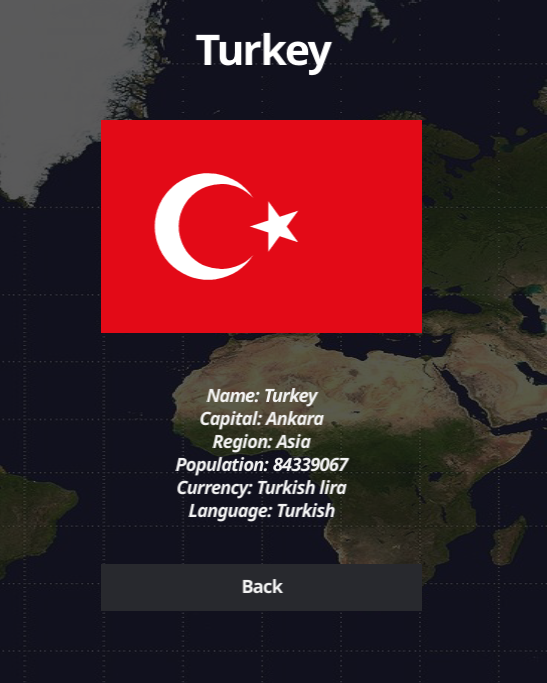
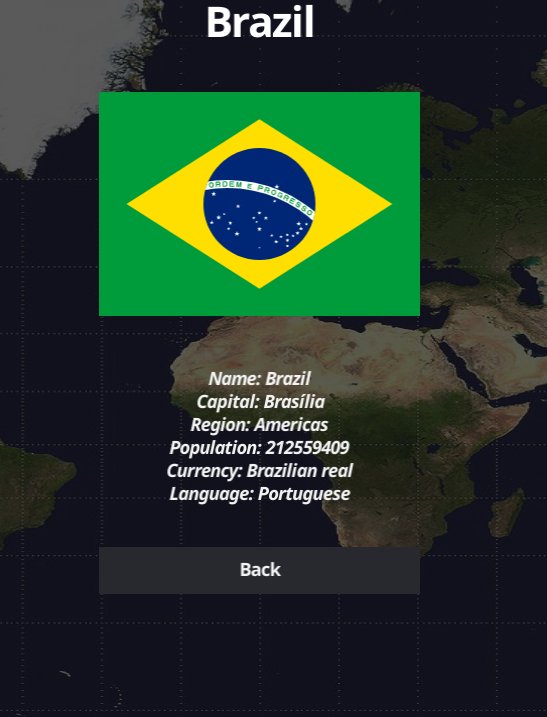
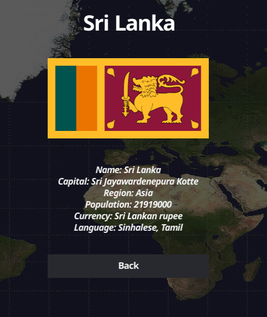

#Countries Desktop App
This is a desktop application that shows general information about countries.

It generally contains the following information about countries ;
  + Name     
  + Capital
  + Region 
  + Population
  + Currency
  + Language

